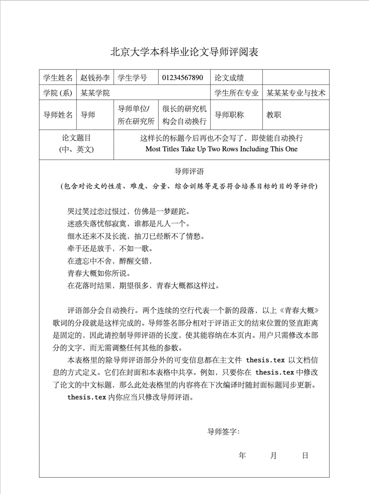

# pku-grad-thesis

北京大学本科生毕业论文 latex 模版，基于 pkuthss 1.9.0 修改。

因为本科生毕业论文格式要求和博士学位论文有所不同，所以该项目主要对格式文件 `pkuthss.cls` 进行了修改和补充，包括：字体字号的设置、页眉的设置、文献的排序、导师评阅表的添加等。

在github项目[pku-grad-thesis](https://github.com/wongsingfo/pku-grad-thesis)和overleaf项目[2021 Peking University Undergraduate Thesis](https://www.overleaf.com/latex/templates/2021-peking-university-undergraduate-thesis/bctgcdnckbdq)的基础上改进。
现在的模版具有以下特点：
- 在符合[研究生毕业论文写作指南](http://grs.pku.edu.cn/xwgz11/xwsy11/ssxw111/clxz08/346392.htm)2018年版V2.0要求的基础上，参考信科2022年提供给本科生的Word模版，**对封面参数和部分字体格式进行了重新设计。**请勿用此模版进行硕(博)士研究生毕业论文的写作！
- **模版将自动根据文档信息生成导师评阅表(除导师评论外)，无需手动填写此表**(这是可能的，因为表格的信息许多和封面是共用的)。请参考现有的评阅表内导师评论里的内容来编辑导师评论。
- **支持单双页设计**。文档默认采用`oneside`生成论文，其特点是没有强制各文档的组成部分(封面、评阅表、版权声明、章节、附录等等)均按奇数页对齐。考虑到打印和装订的方便，如果需要强制其对齐到奇数页，只需将`thesis.tex`文件开头的
```tex
\documentclass[UTF8,oneside]{pkuthss}
```
改成
```tex
\documentclass[UTF8,twoside]{pkuthss}
```
即可。此时所有组成部分都将对齐到奇数页。
- 在封面标题和表格评阅表中**均无需手动为长文本分行**。
- **导师评阅表将自动根据导师评语的长度设计表格高度，无需手动修改任何参数**。这个高度将使得导师评语的结尾和导师签字之间的竖直距离是固定的。

## 效果预览

这里仅展示封面和导师评阅表部分。

封面             |  导师评阅表
:-------------------------:|:-------------------------:
  |  

## 编译配置

1. 下载并安装字体文件。如已有可跳过此步骤。
  - 如果是在Windows平台上编译，请从 https://fontzone.net/ 下载并安装中文字体 (如果已有则无需下载)。所需要的字体文件有：`simsun.ttf`, `simfang.ttf` (搜关键词 fangsong), `simhei.ttf`, `KaiTi.ttf`。字体安装完成后可能要重启一下系统。
  - 如果是在Mac平台上编译，请手动将`ctex-fontset-pkuthss.def`替换成文件`ctex-fontset-pkuthss-mac.def`里的内容(最简单的办法是`mv -f ctex-fontset-pkuthss-mac.def ctex-fontset-pkuthss.def`来强制覆盖写)并确认已下载安装黑体、宋体、楷体三种格式的字体文件。
2. 安装 Latex
  - MacOS: 从 http://www.tug.org/mactex/ 下载并安装 MacTeX。
  - Windows: 从 https://www.tug.org/texlive/ 下载并安装 Texlive-full.

## 编译命令

在终端下，输入命令：

```shell
# 切换工作目录
cd pku-grad-thesis
# 编译
sudo latexmk -f
```

清理编译产生的中间文件：

```
latexmk -c
```

## IDE 配置

### Visual Studio Code

1. 安装插件 LaTeX Workshop
2. 在左侧的插件页面中，选择 Build LaTeX project 中的 Recipe: latexmk (latexmkrc)

### TeXstudio

1. 将选项的 Build 页面卡中 Build & View 的一项修改为：

```
latexmk -silent -synctex=1 % | txs:///view-pdf
```

2. 选择编译并查看